# ArcBase System Architecture & User Flow

## 1. High-Level Overview

ArcBase is a decentralized NFT launchpad protocol built on Base Network. It uses a **Proxy Pattern** to deploy gas-efficient, upgradeable NFT collections.

## 2. User Flow Diagram (Mermaid)

```mermaid
sequenceDiagram
    participant Creator as 🎨 Creator (User)
    participant Web as 🌐 ArcBase Frontend (Bundled)
    participant AppKit as 🔌 AppKit / Wallet
    participant Factory as 🏭 Factory Contract
    participant Proxy as 📦 NFT Collection (Proxy)
    participant IPFS as 🌌 IPFS (Pinata)
    participant Minter as 👤 Public Minter

    %% Deployment Flow
    Note over Creator, IPFS: 1. Creation Phase
    Creator->>Web: Input Details (Name, Price, Image)
    Web->>IPFS: Upload Image & Metadata
    IPFS-->>Web: Return IPFS CID (ipfs://...)
    Creator->>AppKit: Sign Deployment Tx
    AppKit->>Factory: call deployCollection(...)
    Factory->>Proxy: Create New Proxy (Clone)
    Factory-->>Web: Return New Contract Address
    Web-->>Creator: Show "Success" & Load Dashboard

    %% Verification Flow
    Note over Web, Proxy: 2. Verification Phase
    Web->>Web: Auto-Call Verify Logic
    Web-->>Creator: Show "Verify Proxy Manual" Link
    Creator->>Web: Click Verify Link (BaseScan)
    Creator->>Web: Contract Verified ✅

    %% Minting Flow (Public)
    Note over Minter, Proxy: 3. Minting Phase
    Creator->>Minter: Share Link (arcbase.app/?address=0x...)
    Minter->>Web: Open Shared Link
    Web->>Proxy: Fetch Metadata (Name, Price, Supply)
    Minter->>AppKit: Connect Wallet
    Minter->>AppKit: Click "Mint" (Pay ETH)
    AppKit->>Proxy: call mint(quantity) {value: ETH}
    Proxy->>Proxy: Verify Payment & State
    Proxy-->>Minter: Transfer NFT
    
    %% Revenue Flow
    Note over Proxy, Creator: 4. Revenue Distribution
    Proxy->>Proxy: Split Revenue (Pending Balance)
    Creator->>Proxy: call withdraw()
    Proxy-->>Creator: Transfer ETH (Revenue)
```

## 3. Key Components

1.  **ArcBaseFactory**: The "Mother" contract. It deploys new collections using minimal proxies (very cheap gas).
2.  **ArcBaseCollection (Implementation)**: The "Brain". Contains all the logic (Minting, ERC721A, Revenue Split). Detailed verification of this contract allows all proxies to be verified easily.
3.  **Proxy (The NFT)**: The contract deployed for the user. It stores the specific data (Name, Supply, Owner) but delegates logic to the Implementation.
4.  **IPFS**: Decentralized storage for images and metadata. We use Pinata for reliable pinning.
5.  **AppKit**: Handles wallet connection and network switching cleanly.
